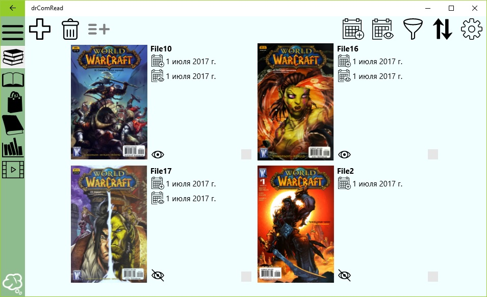
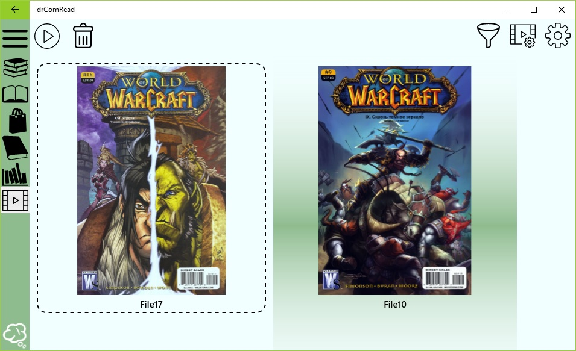

## Quick start
  
To start reading comics using the drComRead application, you only need to complete three steps:  
* Install the program from the store  
* Import comics to the library  
* Create a reading list  

Each of these steps is detailed in detail.  

### Install application from store

To install the program from the store, just go [this reference](https://www.microsoft.com/store/apps/9pk5rnrnqh3q?ocid=badge). Next, the **Store** application opens, where you click on the **Receive** button. You can open the app **Store** only if you use the operating system **Windows 10**. All further actions for installing the application will be taken by **Store**. After installation, you can launch the application directly from **Store** by clicking the **Run** button on the drComRead application page, or from the Start menu in the application list, you need to click **drComRead**.

### Add comic book to library

After running the drComRead application, you will be taken to the library page. While in your library there are no comic books.
To import comics to your library, click on the button  with a plus on the action bar. After that you will go to the page of adding comics. Depending on the platform on which you run the drComRead application, the appearance of this page may be different. On this page you need to select the archive file (s) or the image folder, after which they will be added by the application to the library.

### Forming read list

After you added the comics, you need to return to the library. To do this, click the **Back** button on the mobile device, the **B** button on the Xbox One gamepad or the left arrow button in the upper left corner of the drComRead application window in the case of a desktop device or tablet. Next, you'll see that there are comics in your library located in the form of a grid.  
  
Select any by single clicking on the comic, pressing the DPad from the gamepad and pressing the **A** button or a single tap on the touch-enabled devices. Then click the **Add to Reader** button in the action bar. So you formed your first reading list. Click the Reading List item in the main menu. You will see a list of readings formed from the comics that you selected in the library.  
  
To start viewing comics, just click the **Start read comic books** button in the action bar.

### If something does not work

If you are having trouble, please refer to the troubleshooting section [by this link](knownproblems.md)

### Useful links

[Overview](overview.md)  
[Features](features.md)
