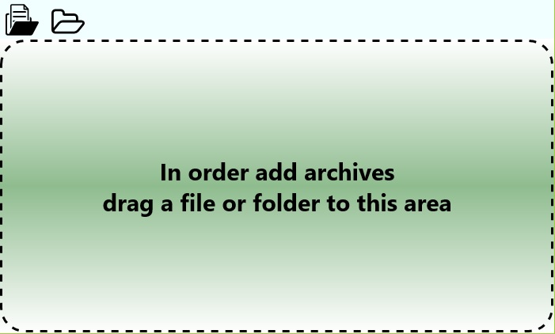

## Adding Comics

The drComRead application allows you to import comics from the user's file system (including any cloud services that support synchronization at the file system level like OneDrive, DropBox, etc.). After importing, the comic is saved to the local storage of the application and no longer requires access to the files and folders from which they are imported.  
For your convenience, various options for importing files and folders are supported. You can import the archive formats CBR / RAR, CBZ / ZIP both alone and the list and even have the ability to find all the archives in the folder including all the subfolders and import them. Also in some cases there are comics distributed not in the form of a but in the form of folders with images. Of course, you can create the archive yourself based on this folder, but the drComRead application can do this for you.  

## Adding archives on desktop systems (including on tablets)

On desktop systems, you can add files using the open file dialog, open folder dialog, and drag-and-drop area.
  
To use the open file dialog, click the **Add Comics from files** button on the action bar.
After clicking, a dialog will open for selecting files where you must select one or more files with the archive formats CBR/RAR, CBZ/ZIP. After confirming the selection by pressing the button **Open**. Then the process of importing the comics will begin, it can take a long time depending on the number of imported files. During the import process, you can use any other applications and functions of the operating system. After the import is finished, the application will be notified to you in the notification center.  
To use the open folder dialog, click the **Add comic from the image** button. After clicking, the file system folder selection dialog opens. You need to select a folder containing images of the formats JPEG, PNG, GIF, TIFF. After confirming the selection, pressing the button **Open** will start the process of importing a folder with images in the form of one comic. During the import process, you can use any other applications and functions of the operating system. After the import is finished, the application will be notified to you in the notification center.  
Also there are You can not use the dialogs to open files and folders but simply drag and drop from most applications of the operating system supporting the work with the file system files and folders directly into the special zone of the window marked with a dashed line. You can drag both files and folders. If the program can not understand your intentions from the selected combination of files and / or folders, it will ask how to import the contents of the files / folders you have selected. The choice is between loading all the archives found in the selected folders including all of their subfolders or creating a single comic book with the name you selected and importing it into all the folders found in the specified folders including all of their subfolders images.  

## Adding archives to mobile devices and the Xbox One console
On mobile devices and the Xbox One console, the appearance of the add page will differ from the desktop version. On the add page there will be a drop-down menu with the choice of the type of the imported entity. Among the options are **Backup file** allows you to open the file selection dialog for selecting the archive (s) from the file system or cloud providers. **Folder with archives** allows you to select a folder to search and import all found archives in it and all its subfolders. **A folder with images** allows you to select a folder to search for and import all images found in it and all its subfolders as a single archive with the name you specified.  

