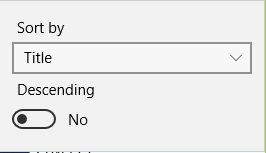
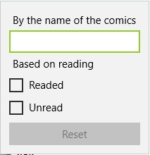
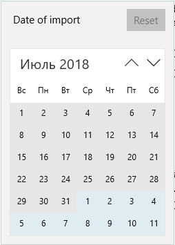

## Comic list filtering

The library is divided into sections, but when the number of comics increases, you need to find some comics or comics. You can use the search and filtering capabilities presented in the drComRead application.  
  
You can find filters and search by date of creation, date of last viewing, search by name and reading attribute and sorting the list.

## Sorting

Sorting the list allows you to arrange items depending on the selected sort field and sort direction.  
  
**Sort by** allows you to select which field of the comics will be sorted. **Descending** allows you to specify the direction of sorting. If downward is active, then the rows will be sorted from the AZ number from 0-1 and the date from the past to the future is otherwise the opposite.

## Search and filter by the name of the comic and the sign of reading

If you need to find a comic by name, you must enter it in the **Name** full name of the comics or part of it. If it is necessary to find read and / or not read comics, check the corresponding items **Readed** и **Unreaded**.  
  
The list will automatically search after changes in the above search fields.

## Search and filter by creation and last viewing dates

By creation and last viewing dates, you can also search and filter the list. The filter for each date is presented in a separate button.  
  
To search by a specific date, you must select one date in the calendar. If you want to search in the range, select two dates in the calendar. If you want to select several specific dates, you must select more than two dates in the calendar.  
The current active date selection mode will be displayed in the header of the calendar panel.
