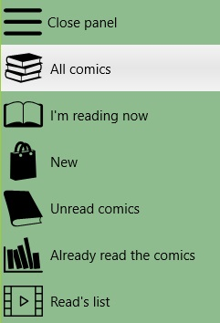

## Sections of the library

The library is divided into sections, so that it would be more convenient to find comics in the library. Total five sections - All comics, Read, New, Unread, Read. In order to switch between sections, you need to use the main menu of the program.  
  
The main menu of the program is displayed on the left and, depending on the size of the program window, can always be displayed in the form of a set of icons or in a hidden form. If there is no main menu, you can open it by clicking on the left side of the screen.  

## All comics

This section contains all the comics that are in the library.

## Reading

In this section there are comics that you opened for reading, but did not read until the end. This sample is convenient if you read a lot of "keep your finger on the pulse" of what you need to finish reading.  

## New

This includes all the comics that have been added in recent times and have not yet been open. This sample allows you to understand what comics cost to put in the reading list, if suddenly you forgot to do it after adding.

## Not readed

This section contains all the comics that were added long ago, but which have never been opened. No unread comic will be lost in the library due to this section.  

## Readed

This section contains all the comics you read all the time.
