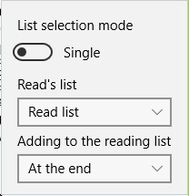

## Library settings

You can change some library settings. To do this, just click the **Settings** button on the action bar.  
  
After that, the settings panel opens.  

## Selection mode

Allows you to change the selection mode of comics in the grid between single and multiple. The default is multiple choice.

## Reading list

You can select a reading list from the drop-down list in which comics will be added. In the current version, you can not add more than one reading list, but in future versions this functionality will be added.  

## Add to Read List

Allows you to configure where the comics will be added to the reading list.  
Available options:
* **End of the list** adds after the most recent comics in the reading list without taking into account the reading sign
* **To the top of the list** adds comics to the very beginning of the reading list without taking into account the reading sign
* **After the current** adds comics after the current starting comics in the reading list with the reading attribute taken into account
* **Before the current** adds comics after the current starting comics in the reading list with the reading attribute taken into account
