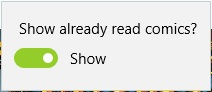

## Settings

On the read list page, there are filtering settings, the current reading list settings and the page reading list settings.
  
All these settings are saved and applied immediately.

### Filter settings

The filter settings affect how the comics in the reading list will be filtered. At the moment, you can choose whether to show or hide the comics in the reading list with the **Show already read comics?**.  
  
Read comics can remain in the read list only if the selected reading list is active **Delete the comics after reading?**.  

### Setting up the current reading list

These settings only affect the currently selected reading list. You can choose whether the comics will be deleted from the reading list during transitions between comic books on the page with the settings **Delete the comics after reading?**.  
  
Comic book become "Readed" when the transition to the next comic from the last page of the current one is made.

### Reading list page settings

Option **Selection mode** allows you to change how many items you can select in the list - one or more. Option **Select read list** affects what kind of reading list is open at the moment.  
  
