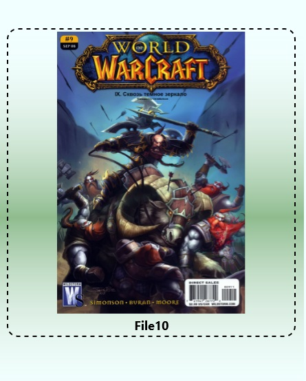

## Viewing a comic book

The reading list allows you to control some aspects of comic book viewing. The list has a horizontal orientation from left to right.

## How do I start read comics?

To do this, just click the **Start read comic books** button in the action bar.
  

## Selected comic book

The reading list is a sequence of comics for viewing. After going to the page **Comics view** a starting comic will open in the reading list. After you read the comics on the reading list, the starter comic will shift to the comic book you opened last. If you exit the comic book view, and then return to the **Reading List** page, then the starting comic will be the one you left on for the last time.  
  
Selected comics marked in the reading list with a dashed line.

## Change selected comic book

You can change the starting comics at any time for this just by choosing some other different from the selected comic book and clicking on it with the right mouse button, long tap (for touch control), the Menu button on the gamepad. In the new selected comic book, the first page for viewing is installed. Those. You will begin reading from the first page of the new start comic.
