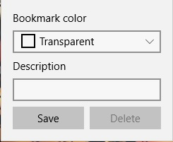

## Bookmarks

In the application there is an opportunity to put bookmarks on the pages of the comics. You just open the comics page you are interested in while browsing and save the bookmark using a special form.  

### Adding a bookmark

To add a bookmark, just click the **Bookmark** button.
  
Then you can choose to bookmark the color in the **Colors field** and add a note in the **Note** field. Bookmark color and note optional fields You can not fill them.
  
To save a bookmark, click the **Save** button. In case you have edited the bookmark fields and go to another page or another comic, the program will ask you if you need to discard the changes or save them.  
  
After saving, the button **Bookmark** will be colored by the color selected by you in the second review and have a hint with the description you entered.  

### Delete a bookmark

To delete the bookmark you created earlier, just click on the button **Bookmark** and click on the button **Delete** in the opened panel.
