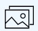
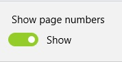
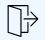

## Thumbnails

Page view of the comic allows you to view only a single comic page and when you need to go over all comics with a quick glance you can use the list of thumbnails. In it, all pages of the comics are arranged in the form of a horizontal list from left to right. It automatically scrolls to the current open page and marks it with a selection. To open the list of thumbnails, just click on the button **Thumbnails**.  

### Change the current comic page

In the list of thumbnails, you can also change the current page of the comic. To do this, you need to scroll the viewport to the page of interest and click the left mouse button, use the arrows from the keyboard, tap for devices with touch input or press the A button on the gamepad.  

### Thumbnail list settings

In order to enter the settings of the thumbnail list, during the open list of thumbnails, click the button ** Configure the list of thumbnails ** in the action bar.  
  
You can configure whether it is necessary to display the numbers in the order next to the miniature page of the comics. The page number is displayed as a number in the upper right corner of the page thumbnail.  
  
Change this setting will be used for all comics.

### Leave thumbnail list

To exit the list of thumbnails, click on the button **Exit** in the action bar.
  
