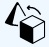
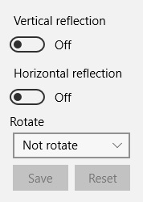

## Transformations

Transformations allow you to perform rotations and mirror image reflections. Transformations are available by clicking on the **Transformations** button.  
  
After clicking on this button, a panel will open in which all the tools for transformation will be available to you.  
  

### Image Rotations

Rotate the image by selecting from the drop-down list of the **Rotation** field. Items are available:
* Not rotated - the starting position
* Rotated by 90°
* Rotated by 180°
* Rotated by 270°
Transformation will occur immediately after selecting one of the menu items.

### Mirror reflection

There are two types of mirror reflection - **Vertical reflection** and **Horizontal reflection**. You can activate and deactivate these items in any combination. Their values are added together if you activate both items. Also, they are added together with the rotations of the image.  

### Reset transformations

After performing any transformations, you can reset them entirely with the **Reset** button. All the settings of the transformations return to their original position.  

### Saving Transformations

If you want to save the transformation you just press the **Save** button. After that, when you return to this page in the future, all the transformations will be performed in accordance with your settings. If you try to go to another page or comics and there are not saved transformations on the current page, the program will offer you either to save the current transformations or discard changes to them.  

