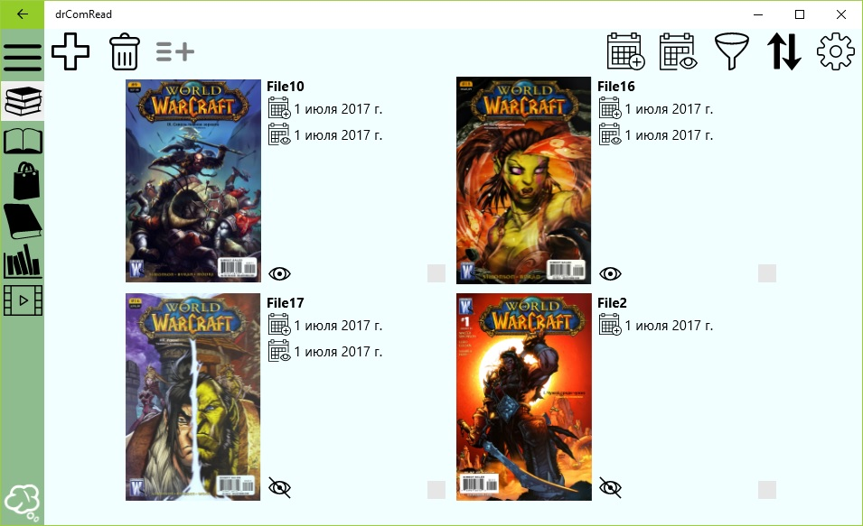
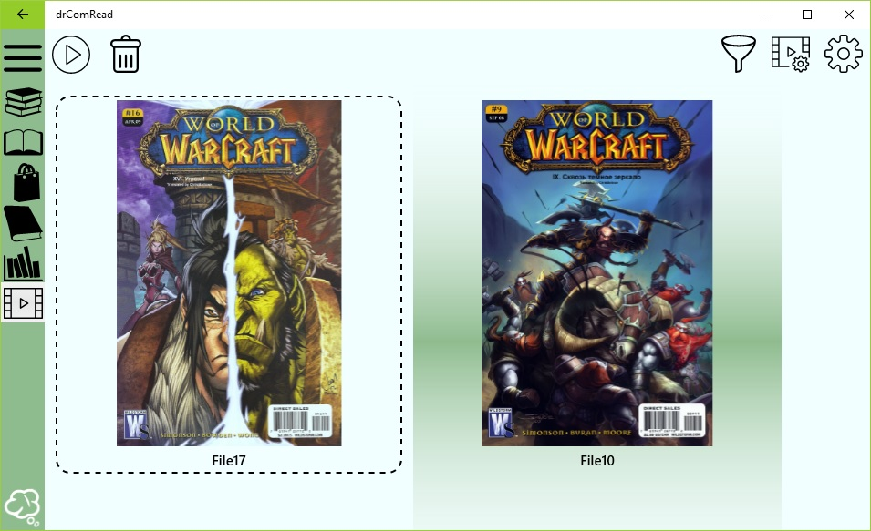

## Быстрое начало работы
  
Чтобы начать читать комиксы с помощью приложения drComRead Вам необходимо выполнить всего три шага:
* Установить программу из магазина
* Добавить комиксы в библиотеку
* Сформировать список чтения  

Далее подробно расписан каждый из этих шагов.

### Установить программу из магазина

Чтобы установить программу из магазина достаточно просто перейти [по этой ссылке](http://blablabla.com). Далее откроется приложение **Магазин** в котором необходимо нажать на кнопку **Получить**. Стоит заметить что приложение **Магазин** откроется только если Вы пользуетесь операционной системой  **Windows 10**.  Все дальнейшие действия по установке приложения возьмет на себя **Магазин**. После установки можно запустить приложение прямо из магазина по кнопке **Запустить** на странице приложения drComRead, либо из меню пуск в списке приложений необходимо нажать на пункт **drComRead**.

### Добавить комиксы в библиотеку

После запуска приложения drComRead Вы попадете на страницу библиотеки. Пока в вашей библиотеке нет комиксов. 
Чтобы добавить комиксы в Вашу библиотеку необходимо нажать на кнопку  с плюсом на панели действий. После чего Вы перейдете на страницу добавления комиксов. В зависимости от платформы на которой Вы запускаете приложение drComRead вид этой страницы может отличаться. На этой странице Вам надо выбрать файл архива(ов) или папку с изображениями после чего они добавятся приложением в библиотеку.  

### Сформировать список чтения

После того как Вы добавили комиксы Вам необходимо вернуться в библиотеку. Для этого нажмите на кнопку **Back** на мобильном устройстве, кнопку **B** на геймпаде Xbox One или на кнопку со стрелкой влево в левом верхнем углу окна приложения drComRead в случае настольного устройства или планшета. Далее Вы увидите что в библиотеке есть добавленные Вами комиксы расположенные в виде сетки. Выберите какие-нибудь путем одиночного клика мыши по интересуещему комиксу, стрелками с DPad с геймпада и нажатием на кнопку **A** или одиночным тапом на устройствах с сенсорным управлением. Далее нажмите на кнопку **Добавить в список чтения** на панели действий. Таким образом Вы сформировали свой первый список чтения. Нажмите в главном меню на пункт Список чтения. Вы увидите список чтения сформированный из комиксов которые вы выделили в библиотеке. 
  
Чтобы начать просмотр комиксов достаточно нажать на кнопку **Начать просмотр комиксов** на панели действий.  

### Если что-то не получилось

Если у Вас что-то не получилось обратитесь к разделу исправления проблем [по этой ссылке](knownproblems.md)

### Полезные ссылки

[Общие сведения о программе](overview.md)  
[Возможности](features.md)
