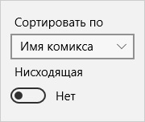
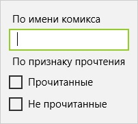
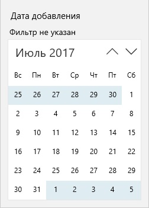

## Фильтрация списка комиксов

Библиотека разбита на разделы но когда количество комиксов увеличивается то необходимо найти какой-то комикс или комиксы Вы можете воспользоваться возможностями поиска и фильтрации представленными в приложении drComRead.  
  
Вам доступны фильтры и поиск по дате создания, дате последнего просмотра, поиск по имени и признаку прочтения и сортировка списка.

## Сортировка

Сортировка списка позволяет Вам упорядовачивовать элементы в зависимости от выбранного поля сортировки и направления сортировки.  
  
**Сортировать по** позволяет выбрать по какому полю комикса будет происходить сортировка. **Нисходящая** позволяет указать направление сортировки. Если активна нисходящая значит что строки будут сортироваться от А-Я числа от 0-1 а даты от прошлого к будущему в ином случае все наоборот.

## Поиск и фильтрация по имени комикса и признаку прочтения

Если необходимо найти какой-то комикс(ы) по имени необходимо ввести в поле **По имени комикса** полное название комикса или его часть. Если необходимо найти прочитанные и/или не прочитанные комиксы проставьте галочки у соответствующих пунктов **Прочитанные** и **Не прочитанные**.  
  
Список автоматически произведет поиск после изменений в вышеупомянутых полях поиска.

## Поиск и фильтрация по датам создания и последнего просмотра

По датам создания и последнего просмотра также можно искать и фильтровать список. Фильтр для каждой из дат представлен в отдельной кнопке.  
  
Чтобы искать по конкретной дате, необходимо выбрать одну дату в календаре. Если необходимо искать в диапазоне выберите две даты в календаре. Если необходимо выбрать несколько конкретных дат необходимо выбрать более двух дат в календаре.  
Текущий активный режим выбора дат будет отображаться в заголовке панели с календарем.
