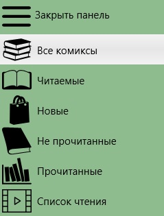

## Разделы библиотеки

Библиотека разделена на разделы, для того чтобы было удобней находить комиксы в библиотеке. Всего пять разделов - Все комиксы, Читаемые, Новые, Не прочитанные, Прочитанные. Для того чтобы переключаться между разделами, необходимо использовать главное меню программы.  
  
Главное меню программы отображается слева и в зависимости от размера окна программы может отображаться всегда, в виде набора значков или в скрытом виде. Если главного меню нет Вы можете его открыть, выполнив смахивание с левой стороны экрана.

## Все комиксы

В данном разделе расположены все комиксы, которые есть в библиотеке.

## Читаемые

В этом разделе расположены комиксы, которые Вы открыли для чтения, но не прочитали до конца. Данная выборка удобна, если Вы много читаете "держать руку на пульсе" того, что необходимо дочитать.

## Новые

Сюда попадают все комиксы которые были добавлены в течении недавнего времени и еще не были не разу открыты. Эта выборка позволяет понять какие комиксы стоить положить в список чтения если вдруг Вы забыли это сделать после добавления.

## Не прочитанные

Данный раздел содержит все комиксы, добавленные давно, но которые ни разу не открывались. Ни один непрочитанный комикс не затеряется в библиотеке благодаря этому разделу.

## Прочитанные

Этот раздел содержит все прочитанные Вами комиксы за все время.
