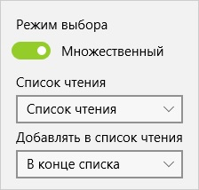

## Настройки библиотеки

Вы можете изменить некоторые настройки библиотеки. Для этого достаточно нажать на кнопку **Настройки библиотеки** на панеля действий.  
  
После этого откроется панель настроек.  

## Режим выбора

Позволяет изменить режим выбора комиксов в сетке между одиночным и множественным. По умолчанию установлен множественный выбор.

## Список чтения

Вы можете выбрать список чтения из выпадающего списка в который будет происходить добавление комиксов. В текущей версии нельзя добавить больше одного списка чтения но в будущих версиях этот функционал будет добавлен.

## Добавлять в список чтения

Позволяет настроить то в какое место будут добавляться комиксы в список чтения.  
Доступные варианты:
* **В конце списка** добавляет после самого последнего комикса в списке чтения без учета признака прочтения
* **В начало списка** добавляет комиксы в самое начало списка чтения без учета признака прочтения
* **После текущего** добавляет комиксы после текущего стартового комикса в списке чтения с учетом признака чтения
* **Перед текущим** добавляет комиксы после текущего стартового комикса в списке чтения с учетом признака чтения
