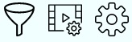

## Настройка списка чтения

На странице список чтения есть настройки фильтрации, настройки текущего списка чтения и настройки страницы список чтения.  

### Настройки фильтрации

Настройки фильтрации влияют на то как будет фильтроваться комиксы в списке чтения. На текущий момент можно выбрать будут ли показываться или скрываться прочитанные комиксы в списке чтения с помощью переключателя **Показывать прочитанные комиксы**.  
  
Прочитанные комиксы могут оставаться в списке чтения только если активна настройка выбранного списка чтения **Удалять комиксы после прочтения**.

### Настройка текущего списка чтения

Эти настройки влияют только то выбранный в данный момент список чтения. Вы можете выбрать будут ли комиксы удаляться из списка чтения Во время переходов между комиксами на странице **Просмотр комикса** с помощью настройки **Удалять комиксы после прочтения**.  
  
Прочитанным считается комикс когда произведен переход на следующий комикс с последней страницы текущего.

### Настройки страницы списка чтения

