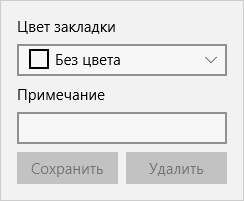

## Закладки

В приложении есть возможность ставить закладки на страницы комикса. Вам достаточно открыть интересующую Вас страницу комикса во время просмотра и сохранить закладку с помощью специальной формы.

### Добавление закладки

Для того чтобы добавить закладку достаточно нажать на кнопку **Закладка**.  
  
После чего Вы можете выбрать для закладки цвет в поле **Цвет закладки** и добавить примечание в поле **Примечание**. Цвет закладки и примечание необязательные поля Вы можете их не заполнять.  
  
Чтобы сохранить закладку необходимо нажать на кнопку **Сохранить**. На случай если Вы отредактировали поля закладки и переходите на другую  страницу или другой комикс программа спросит Вас о том нужно ли отбросить изменения или сохранить их.  
  
После сохранения кнопка **Закладка** при повторном просмотре будет подкрашиваться выбранным Вами цветом и иметь подсказку с введенным Вами описанием.

### Удаление закладки

Чтобы удалить созданную Вами ранее закладку достаточно нажать на кнопку **Закладка** и в открывшийся панели нажать на кнопку **Удалить**.
