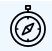
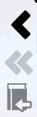

## Навигация

Навигация по страницам комикса одно из самых важнейших элементов просмотра комиксов. Весь функционал навигации доступен при нажатии на кнопку **Навигация**.  
  
Но кроме этого доступно и множество дополнительных возможностей позволяющих выполнять навигацию:
* Индикатор граней можно дополнить кнопками навигации. Рассчитан на устройства только с touch управлением, но может применять по желанию и для любых других.
* Навигационные панели позволяют выполнять навигацию с использованием мыши без ущерба для просмотра.
* Также можно управляйте навигацией с помощью геймпада или клавиатуры. В разделе ниже представлены описания клавиш для навигации.

### Меню Навигация

После нажатия на кнопку **Навигация** отрывается меню. Данное меню позволяет настраивать возможности связанные с навигацией и выполнять саму навигацию. Но так как управление самой навигацией через меню скорей всего не удобно в следюущих разделах описаны более простые методы навигации. Здесь же описана работа навигации в целом.

#### Индикатор граней

  
Это специальный элемент управления на котором отмечаются стороны изображения которые находятся внутри области просмотра либо с его края. Т.е. если достигнут правый край изображения то значит что мы достигли правого конца изображения. Стороны в индикаторе граней отмечаются зеленым полосами по тем сторонам изображения которые находятся внутри области просмотра либо с его края.  
Для настройки индикатора граней войдите в меню **Индикатор граней** после нажатия на кнопку **Навигация** и активируйте или деактивируйте необходимые пункты:
* **Скрывать навигацию по страницам** влияет на то будут ли отображаться кнопки навигации **Предыдущая страница или комикс** и **Следующая страница или комикс** (они видны на рисунке в начале раздела как кнопки со стрелками).
* **Скрывать навигацию по концам** влияет на то будут ли отображаться кнопки навигации **На первую страницу комикса** и **На последнюю страницу комикса**. Это две дополнительные кнопки будут отображаться справа от кнопок со стрелками на рисунке в начале раздела.
* **Скрывать неактуальные кнопки** влияет на то будут ли скрываться кнопки **На первую страницу комикса**, **На последнюю страницу комикса**, **Предыдущая страница или комикс**, **Следующая страница или комикс**, если они видимы благодаря двум настройкам выше, тогда когда нет условий для их работы. Например когда мы находимся на первой странице комикса то кнопка **На первую страницу комикса** не активна, если эта настройка включена в этот момент она не будет отображаться в элементе управления.

#### Навигационные панели

  
Навигационные панели позволяются выполнять навигацию по страницам комикса и переходить на следующий и предыдущий комикс. Данные панели доступны при наличии устройства управления мышь, в ином случае они не будут доступны. Чтобы открыть панель навигации достаточно провести мышью к левой или правой стороне окна. Панель с левой стороны позволяет переходить на предыдущую страницу комикса, первую страницу комикса и предыдущий комикс (кнопки показаны на рисунке в начале раздела и перечислены здесь сверху вниз). Панель с правой стороны позволяет переходить на следующую страницу комикса, последнюю страницу комикса и следующий комикс (кнопки показаны на рисунке в начале раздела и перечислены здесь сверху вниз). Данные кнопки могут быть не активны в случае если нет возможности куда-то перейти.  
Для настройки видимости панелей навигации войдите в меню **Навигационные панели** после нажатия на кнопку **Навигация** и активируйте или деактивируйте один из двух пунктов меню для того чтобы скрыть или отобразить панели навигации.

