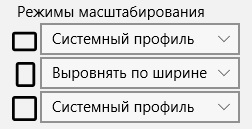

## Настройки

Настройки просмотра комиксов позволяют менять режимы масштабирования изображения а также видимость страниц обложек и дополнительных обложек. Чтобы открыть настройки страницы Просмотр комикса нажмите на кнопку **Настройки**.  

### Режимы масштабирования

Режимы масштабирования представлены в виде трех настроек ориентаций. Портретной, альбомной и квадратной. Настройки указываются для каждой из них отдельно.  
  
Настройки масштабирования зависят от размера окна и/или доступной области просмотра.  
Доступны следующие настройки масштабирования:
* Оригинальный размер
* Выровнять по ширине
* Выровнять по высоте
* Системный профиль

Оригинальный размер подразумевает что изображение будет отображаться на холсте с использованием своего оригинального размера. Данный режим просмотра удобен только для комиксов в формате стрипов (comic strip) потому что они имеют очень маленький размер.

