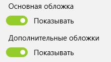
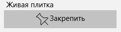

## Настройки

Настройки просмотра комиксов позволяют менять режимы масштабирования изображения а также видимость страниц обложек и дополнительных обложек. Чтобы открыть настройки страницы Просмотр комикса нажмите на кнопку **Настройки**.  

### Режимы масштабирования

Режимы масштабирования представлены в виде трех настроек ориентаций. Портретной, альбомной и квадратной. Настройки указываются для каждой из них отдельно.  
  
Настройки масштабирования зависят от размера окна и/или доступной области просмотра.  
Доступны следующие настройки масштабирования:
* Оригинальный размер
* Выровнять по ширине
* Выровнять по высоте
* Системный профиль

**Оригинальный размер** подразумевает что изображение будет отображаться на холсте с использованием своего оригинального размера. Данный режим просмотра удобен только для комиксов в формате стрипов (comic strip) потому что они имеют очень маленький размер.
**Выровнять по ширине** походит для изображений в портретной ориентации такой как у обычных страниц комикса. Ширина изображения подгоняется по ширину окна (или области просмотра). При изменении размеров окна изменяется и размер изображения.
**Выровнять по высоте** походит для изображений в альбомной ориентации такой как у разворота страниц комикса, или двух страниц за раз. Высота изображения подгоняется по высоте окна (или области просмотра). При изменении размеров окна изменяется и размер изображения.
**Системный профиль** это настройка по умолчанию. Системный профиль содержит сопоставления для различных размеров окна/области просмотра и изменяет их автоматически при изменении их размеров. Данная настройка полагается на ряд подготовленных размеров и сопоставлений к ним. На текущий момент времени количество размеров не велико, поэтому если в Вашем случае масштабирование Вас не удовлетворяет, рекомендуется изменить на одну из настроек указанных выше.

### Видимость обложек

По умолчанию во время просмотра доступны все страницы включая обложки. Но возможно Вам не хотелось бы начинать просмотр комиксов с обложки а непосредственно сразу начать чтение комикса. Для этого есть настройки которые позволят Вам не включать обложки в список страниц просмотра комикса.  
  
Для изменения этого поведения необходимо выключить один или оба переключателя **Основная обложка** и **Дополнительные обложки**.

### Живая плитка

Начиная с Windows 8 появилась возможность добавлять живые плитки в специальный рабочий стол, а в Windows 10 и в меню Пуск. Вы можете добавить плитку которая будет показывать информацию о том какой последний комикс Вы читали, на какой странице закончили и превью самой страницы.  
  
Чтобы добавить живую плитку достаточно просто нажать на кнопку **Закрепить** и ответить утвердительно в системном диалоге.

