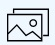
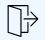

## Список миниатюр

Страница просмотр комикса позволяет просматривать только отдельную страницу комикса а когда необходимо пробежаться по всем комиксам быстрым взглядом можно воспользоваться списком миниатюр. В нем все страницы комикса расположены в виде горизонтального списка слева направо. Он автоматическа прокручивается до текущей открытой страницы и помечает её выделением. Чтобы открыть список миниатюр достаточно нажать на кнопку **Просмотреть все страницы комикса в виде списка миниатюр**.  

### Изменение текущей страницы комикса

В списка миниатюр также можно изменить текущую просматриваемую страницу комикса. Для этого необходимо прокрутить область просмотра к интересующей странице и кликнуть левой кнопкой мыши, использовать стрелки с клавиатуры, выполнить тап для устройств с touch вводом или нажать на кнопку A на геймпаде.

### Настройки списка миниатюр

Для того чтобы войти в настройки списка миниатюр необходимо во время открытого списка миниатюр нажать на кнопку **Настройка списка миниатюр** на панели действий.  
  
Вы можете настроить то необходимо ли отображать номера по порядку следования рядом с миниатюрой страницы комикса. Номер страницы отображается в виде числа в правом верхнем углу миниатюры страницы.  
  
Изменение этой настройки будут использоваться для всех комиксов.

### Покинуть список миниатюр

Чтобы выйти из списка миниатюр необходимо нажать на кнопку **Выйти из списка миниатюр** на панели действий.  
  
