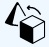
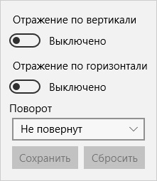
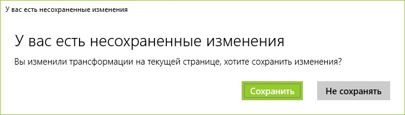

## Трансформации

Трансформации позволяют Вам выполнять повороты и зеркальные отражения изображения. Трансформации доступны по нажатию на кнопку **Преобразования**.  
  
После нажатия на эту кнопку откроется панель в котором Вам будут доступны все инструменты для трансформации.  
  

### Повороты изображения

Поворот изображения выполняеться выбором из выпадающего списка поля **Поворот**. Доступны пункты:
* Не повернут - исходное положение
* Повернут на 90°
* Повернут на 180°
* Повернут на 270°  

Трансформация произойдет сразу после выбора одного из пунктов меню.

### Зеркальное отражение

Есть два вида зеркального отражения - **Отражение по вертикали** и **Отражение по горизонтали**. Вы можете активировать и деактивировать эти пункты в любой комбинации. Их значения суммируются если активировать оба пункта. Также они суммируются вместе с поворотами изображения.

### Сброс трансформаций

После выполнения любых трансформаций Вы можете сбросить их целиком с помощью кнопки **Сбросить**. Все настройки трансформаций вернуться в исходное положение.

### Сохранение трансформаций

Если Вы хотите сохранить трансформации Вам достаточно нажать на кнопку **Сохранить**. После этого когда Вы вернетесь на эту страницу в дальнейшем все трансформации будут выполнены в соответствии с Вашими настройками. Если попытаться перейти на другую страницу или комикс и имеются не сохраненные трансформации на текущей странице программа предложит Вам либо сохранить текущие трансформации либо отбросить изменения по ним.  

